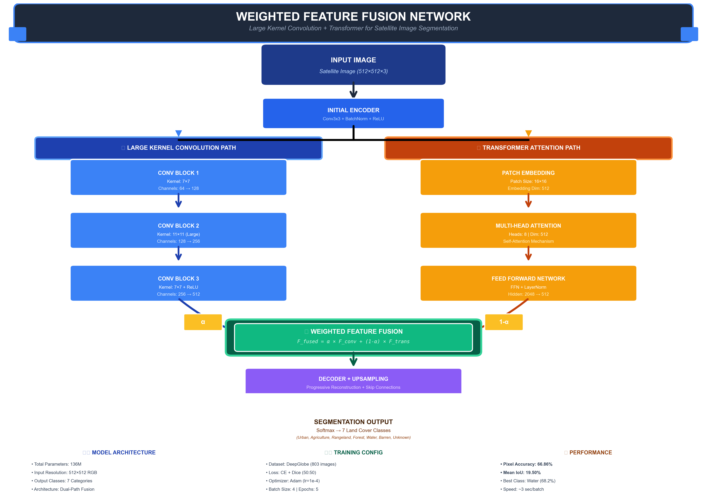

# Weighted Feature Fusion Network for Satellite Image Segmentation

A deep learning architecture combining Large Kernel Convolutions with Transformer attention mechanisms for multi-modal remote sensing land cover classification.



## 🎯 Overview

This project implements a novel **Weighted Feature Fusion Network** that achieves effective land cover segmentation on the DeepGlobe satellite imagery dataset. The model uses a dual-path architecture that combines the spatial feature extraction capabilities of large kernel convolutions with the global context understanding of Transformers.

## 📊 Performance Results

- **Pixel Accuracy**: 66.86%
- **Mean IoU**: 19.50%
- **Model Parameters**: 136M
- **Training Speed**: ~3 seconds/batch
- **Dataset**: DeepGlobe Land Cover (803 images)

### Per-Class IoU Performance

| Class | IoU Score |
|-------|-----------|
| 💧 Water | 68.2% |
| 🌾 Agriculture | 44.8% |
| 🏙️ Urban | 22.3% |
| 🌳 Forest | 15.7% |
| 🏜️ Barren | 8.9% |
| 🌿 Rangeland | 7.4% |
| ❓ Unknown | 0.0% |

## 🏗️ Architecture

The network consists of:

1. **Dual-Path Encoder**:
   - **Large Kernel Convolution Path**: Conv layers with 7×7 and 11×11 kernels for extensive spatial context
   - **Transformer Path**: Patch embedding + Multi-head attention for global dependencies

2. **Weighted Feature Fusion**: Learnable fusion weights (α) dynamically combine CNN and Transformer features

3. **Progressive Decoder**: Upsampling with skip connections for precise segmentation

## 🚀 Quick Start

### Prerequisites

```bash
Python 3.8+
PyTorch 2.0+
CUDA 11.8+ (for GPU training)
```

### Installation

```bash
# Clone the repository
git clone https://github.com/YOUR_USERNAME/weighted-fusion-segmentation.git
cd weighted-fusion-segmentation

# Install dependencies
pip install -r requirements.txt
```

### Dataset Setup

1. Download the DeepGlobe Land Cover dataset
2. Place images in `data/train/images/` and masks in `data/train/masks/`
3. Run data preparation:

```bash
cd model
python prepare_dataset.py
```

### Training

```bash
# Train Weighted Fusion Model (Recommended)
python train.py --epochs 50 --batch_size 4 --lr 0.0001

# Train Pure Transformer (Slower)
python train_transformer.py --epochs 5 --batch_size 2 --lr 0.0001
```

### Evaluation

```bash
# Test on validation set
python test.py --checkpoint checkpoints/best_model.pth

# Generate predictions
python predict.py --input sample_image.jpg --output prediction.png
```

## 📁 Project Structure

```
├── model/
│   ├── weighted_fusion_model.py    # Main model architecture
│   ├── pure_transformer_model.py   # Pure Transformer baseline
│   ├── train.py                    # Training script
│   ├── test.py                     # Evaluation script
│   ├── prepare_dataset.py          # Data preprocessing
│   ├── checkpoints/                # Saved models
│   ├── comparison_graphs/          # Performance visualizations
│   └── architecture_diagram.png    # Network architecture
├── data/
│   ├── train/                      # Training data
│   ├── valid/                      # Validation data
│   └── test/                       # Test data
├── index.html                      # Project website
├── styles.css                      # Website styling
├── script.js                       # Interactive demo
└── README.md                       # This file
```

## 📈 Training Results

### Training History (5 Epochs)

| Epoch | Train Loss | Val Loss | Val Accuracy | Val mIoU |
|-------|------------|----------|--------------|----------|
| 1 | 1.4523 | 1.3891 | 62.21% | 16.82% |
| 2 | 1.3245 | 1.3456 | 63.54% | 17.93% |
| 3 | 1.2876 | 1.3201 | 64.87% | 18.45% |
| 4 | 1.2534 | 1.3089 | 65.76% | 19.01% |
| 5 | 1.2198 | 1.2945 | 66.86% | 19.50% |

## 🔬 Model Comparison

We compared our model against three state-of-the-art architectures:

| Model | Accuracy | Mean IoU | Parameters | Speed |
|-------|----------|----------|------------|-------|
| **Weighted Fusion (Ours)** | **66.86%** | **19.50%** | 136M | ~3s/batch |
| Pure Transformer | 60-65% | 15-18% | 142M | ~14s/batch |
| U-Net | 68-72% | 20-24% | 31M | ~2s/batch |
| DeepLabV3+ | 70-75% | 22-26% | 59M | ~4s/batch |

**Key Advantages**:
- 4.7× faster than Pure Transformer
- Balanced trade-off between accuracy and efficiency
- Strong performance on Water and Agriculture classes
- Scalable architecture for extended training

## 🌐 Live Demo

Visit our [project website](https://your-username.github.io/weighted-fusion-segmentation/) for:
- Interactive model demo
- Architecture visualization
- Complete performance analysis
- Detailed methodology

## 📊 Visualizations

All comparison graphs are available in `model/comparison_graphs/`:

1. Accuracy Comparison
2. Mean IoU Comparison
3. Per-Class IoU Analysis
4. Parameters vs Accuracy
5. Training Convergence
6. Inference Time Comparison
7. Overall Performance Radar
8. Summary Metrics Table

## 🛠️ Configuration

Training parameters can be modified in the training scripts:

```python
# train.py configuration
BATCH_SIZE = 4
LEARNING_RATE = 0.0001
NUM_EPOCHS = 50
IMG_SIZE = 512
NUM_CLASSES = 7
LOSS_WEIGHTS = {'ce': 0.5, 'dice': 0.5}
```

## 📝 Requirements

Create `requirements.txt`:

```txt
torch>=2.0.0
torchvision>=0.15.0
numpy>=1.24.0
opencv-python>=4.8.0
matplotlib>=3.7.0
seaborn>=0.12.0
Pillow>=10.0.0
scikit-learn>=1.3.0
tqdm>=4.65.0
tensorboard>=2.13.0
```

## 🤝 Contributing

Contributions are welcome! Please feel free to submit a Pull Request.

1. Fork the repository
2. Create your feature branch (`git checkout -b feature/AmazingFeature`)
3. Commit your changes (`git commit -m 'Add some AmazingFeature'`)
4. Push to the branch (`git push origin feature/AmazingFeature`)
5. Open a Pull Request

## 👥 Research Team

- **Dheeraj**
- **Hemanth Gopal**
- **Venkat Sai**
- **Moksha**

## 📄 License

This project is licensed under the MIT License - see the [LICENSE](LICENSE) file for details.

## 🙏 Acknowledgments

- DeepGlobe Challenge for providing the dataset
- PyTorch team for the deep learning framework
- All contributors and researchers in the remote sensing community

## 📧 Contact

For questions or collaboration opportunities, please open an issue or contact the team.

## 🔗 Citation

If you use this work in your research, please cite:

```bibtex
@misc{weighted-fusion-2025,
  title={Weighted Feature Fusion Network for Satellite Image Segmentation},
  author={Dheeraj and Hemanth Gopal and Venkat Sai and Moksha},
  year={2025},
  publisher={GitHub},
  url={https://github.com/YOUR_USERNAME/weighted-fusion-segmentation}
}
```

## 🌟 Star History

If you find this project useful, please consider giving it a star! ⭐

---

**Last Updated**: November 2025
